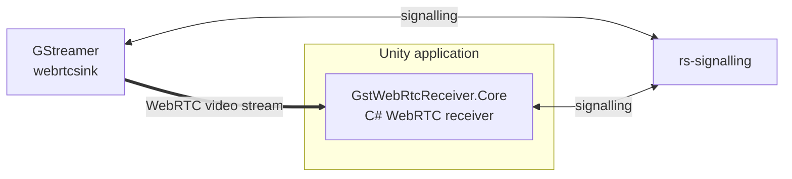

# gst-playground — Unity WebRTC receiver fork

This fork contains changes to the C# WebRTC client from `gst-playground` for use inside Unity.

## Main changes

The original project provides a GStreamer WebRTC test environment
with a browser-based JavaScript client.

This fork adds a C# receiving path for Unity integration.

### `csharp/MinimalWebRtcClient/`

C# console application used to test connection to the existing
GStreamer WebRTC infrastructure without Unity.

### `csharp/GstWebRtcReceiver.Core/`

Reusable C# WebRTC receiver extracted from the console prototype.

It is used by the Unity project to:

- connect to `rs-signalling`;
- perform WebRTC negotiation;
- receive the video stream;
- expose received video data to Unity.
## Current test architecture

The current test setup uses GStreamer as the WebRTC video sender and `GstWebRtcReceiver.Core` as the C# WebRTC receiver inside Unity.

## Main modified directories

### `csharp/GstWebRtcReceiver.Core/`

Reusable C# WebRTC receiver.

Responsibilities:

* connection to `rs-signalling`;
* SDP and ICE handling;
* WebRTC connection setup;
* RTP video reception;
* exposing received video data through C# events/callbacks.

