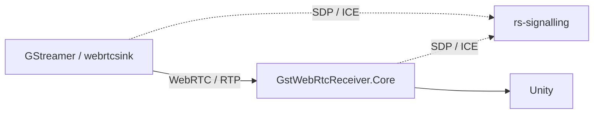

# gst-playground — Unity integration fork

This fork contains changes to the C# WebRTC receiver used for Unity integration (`GstWebRtcReceiver.Core`).

The original `gst-playground` project is used as a test environment for the GStreamer/WebRTC connection.
The C# receiver was separated from the console application so that the same WebRTC logic can be reused inside the Unity project.

## Main changes

### `csharp/GstWebRtcReceiver.Core/`

Reusable C# WebRTC receiver extracted from the original console client.

It contains the main WebRTC logic:

* connection to `rs-signalling`;
* SDP and ICE exchange;
* DTLS/SRTP connection handling;
* RTP video reception;
* delivery of received video data to the application using C# events/callbacks.

This library is used by the Unity project.

### `csharp/MinimalWebRtcClient/`

The console client is kept as a simple smoke test for `GstWebRtcReceiver.Core`.

It allows the WebRTC receiver to be tested independently from Unity.

## Current test setup

The GStreamer test source currently replaces the future real video source.
The Unity-side implementation is maintained in the `Unity_bridge` repository.
