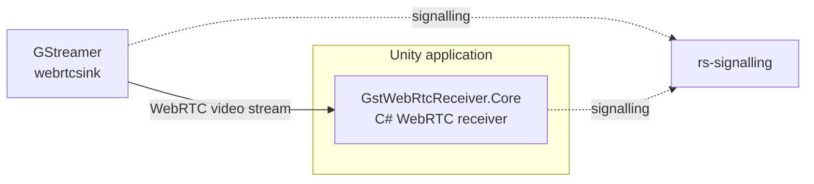

# gst-playground — Unity WebRTC receiver fork

This fork contains changes to the C# WebRTC client from `gst-playground` for use inside Unity.

## What was changed

The original C# console WebRTC client was refactored so that its WebRTC logic can be reused outside the console application.

The receiver logic was moved into:

`csharp/GstWebRtcReceiver.Core/`

The original console application remains as a simple test client:

`csharp/MinimalWebRtcClient/`

`GstWebRtcReceiver.Core` is then used inside the Unity project.

## Current test architecture

`rs-signalling` is used only to establish the WebRTC connection.

The video stream itself is transferred from the GStreamer WebRTC sender to `GstWebRtcReceiver.Core`.

## Main modified directories

### `csharp/GstWebRtcReceiver.Core/`

Reusable C# WebRTC receiver.

Responsibilities:

* connection to `rs-signalling`;
* SDP and ICE handling;
* WebRTC connection setup;
* RTP video reception;
* exposing received video data through C# events/callbacks.

### `csharp/MinimalWebRtcClient/`

Console smoke test for `GstWebRtcReceiver.Core`.

It allows the receiver to be tested independently from Unity.

## Relation to the Unity project

The Unity project references `GstWebRtcReceiver.Core` and uses it as its WebRTC receiver.

At the current stage, `gst-playground` is used as a test environment for the GStreamer/WebRTC side of the system.
